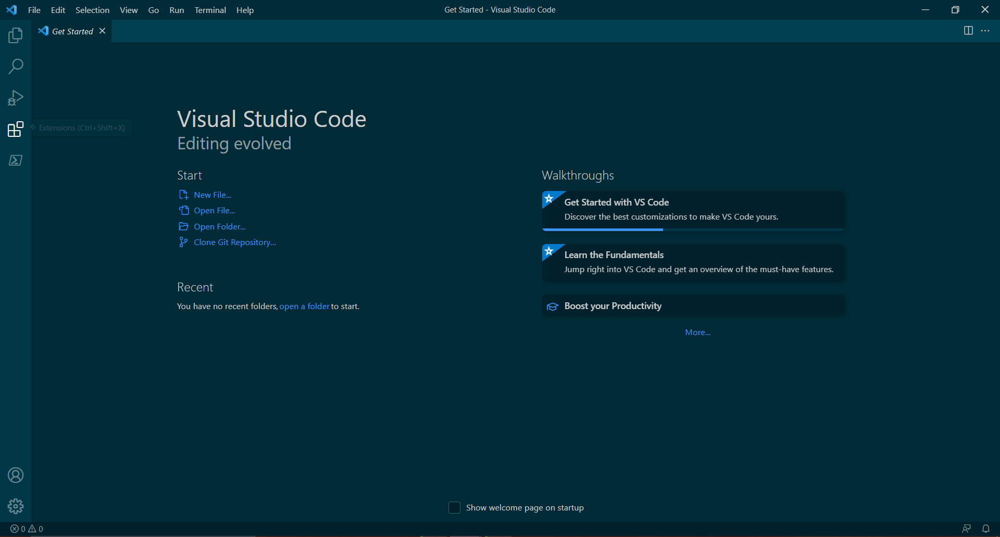
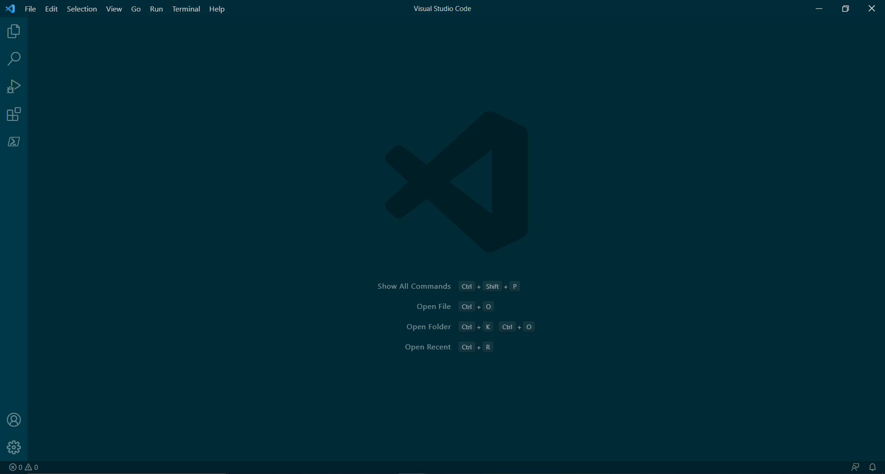

# CSE 15L Lab Report 1
## How to Access a Remote Server

### Installing VSCode
Visit [code.visualstudio.com](https://code.visualstudio.com/), download & install Visual Studio Code on your device. When complete, open VSCode if it does not automatically. The first thing you should see is the *Getting Started* page, but after clearing it you should see a screen like this (The colors may be different depending on your display settings in VSCode): 
|  |  | 
### Remotely Connecting
### Testing Some Commands
### Moving Files with `scp`
### Setting an SSH Key
### Optimizing Remote Running
