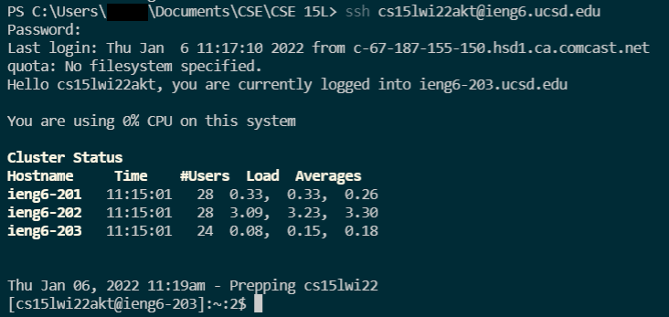
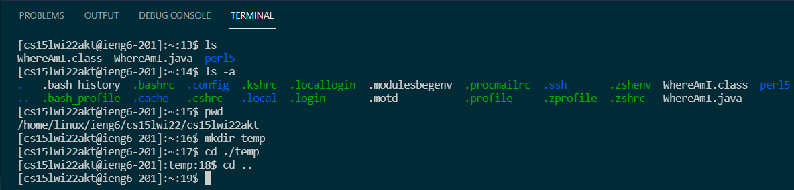
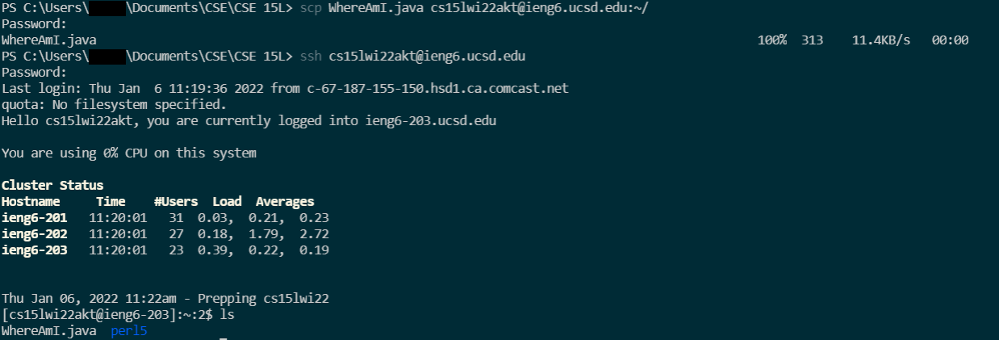
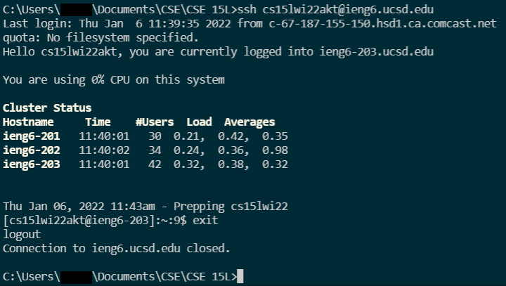
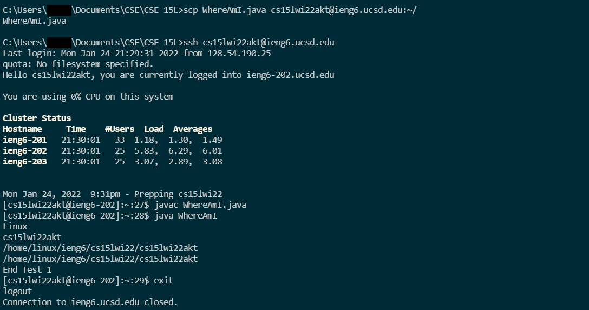
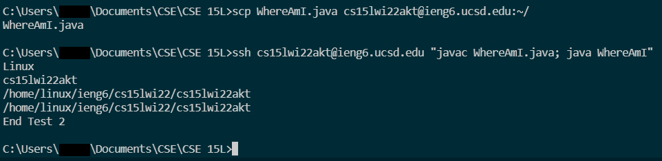

# CSE 15L Lab Report 1  How to Access a Remote Server

## Installing VSCode
Visit [code.visualstudio.com](https://code.visualstudio.com/), download & install Visual Studio Code on your device. When complete, open VSCode if it does not automatically. The first thing you should see is the *Getting Started* page, but after clearing it you should see a screen like this:   
(The colors may be different depending on your display settings in VSCode)   
   
   
   

## Remotely Connecting
**For Windows Users**, Before actually connecting to a server, another install is required. Install OpenSSH by opening the Settings, navigating to Apps > Apps & Features, and selecting Optional Features. From there find Open SSH Client & Open SSH Server and install them if they aren't already installed.  

With SSH installed, in VSCode, open a new terminal by finding Terminal > New Terminal at the top of the window. Alternatively, type **`cmd`** into the Windows search bar to open the command prompt terminal.  
Next you are going to log in with your UCSD course specific username which can be found [here](https://sdacs.ucsd.edu/~icc/index.php). After entering your credentials, you should see under *Additional Accounts* a list of accounts registered with your UCSD account. These are what we'll be using to connect remotely. You may need to change your password before you can successfully login remotely (Note that this will change your TritonLink password as well). With your username, enter the following command:   
**`ssh <username>@ieng6.ucsd.edu`**   

Type your password, you won't be able to see the password on the terminal so don't panic thinking your inputs aren't being read.   
And with your password entered, you should now be connected to a remote server. In this case, that server is one of the computers in the CSE basement. Type **`exit`** to logout and close the remote connection.

## Testing Some Commands
Whether you're remotely connected or working locally, here are some commands to help familiarize or refamiliarize you with the terminal interface.  
**`cd <path>`** - changes the current directory to the specified path.  
**`cd ..`** - moves the user to the parent directory.   
**`ls`** - lists the files in a directory.   
**`ls -a`** - lists all files a directory, including hidden files.  
**`mkdir`** - makes a new subdirectory from the current directory.    
**`pwd`** - prints the full path name of the current directory to the terminal.  

Examples of commands in action:   

## Moving Files with scp
Similar to sending an email with file attachments, files can be sent between client and server with a secure copy. Type **`scp`**, followed by the file you wish to copy, and your account login, ending with **`:~/`**. All together it should look like this: 
**`scp <filename> <username>@ieng6.ucsd.edu:~/`**

## Setting an SSH Key
To skip typing out your password every time you want to log in remotely, use SSH Keys. Simply type **`ssh-keygen`** in the terminal, enter where you want to store the file that contains your key and your done. Don't worry about memorizing the generated randomart image, you won't need to type it in for login. **`ssh-keygen`** generates 2 keys, one public and one private. The public key is stored on the server and the private key is stored on the client. Don't share the private key, it's called a private key for a reason. When you want to login again with **`ssh`** or copy files with **`scp`**, the two keys are compared and if they match, you are logged into the remote server, no password necessary.  

## Optimizing Remote Running
Helpful shortcuts in the terminal:
- Wrapping a command in quotes after an ssh command will run the command remotely and exit the remote connection
- Using semicolons allows for multiple commands to be run on one line in the terminal
    - Combining the above steps allows multiple commands to be run remotely
    
- Use the up arrow to recall the most recent commands
- Use the tab key to autofill directories and files

Here's a comparison between compiling and running a program with a mix of the aformentioned optimizations.  
*For each test, the only differences are in the optimizations provided in this step only.*  

### Test 1: Not Optimized   
**Number of Lines: 5; Number of Keystrokes: 115; Time Taken: 5 minutes**   

### Test 2: Optimized   
**Number of Lines: 2; Number of Keystrokes: 40; Time Taken: 2 minutes**  

