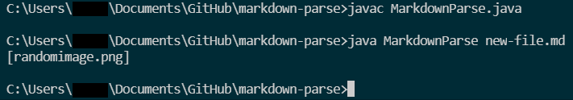
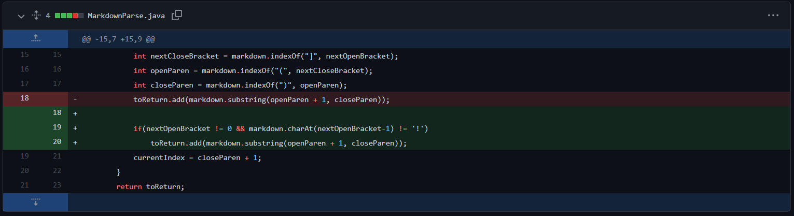
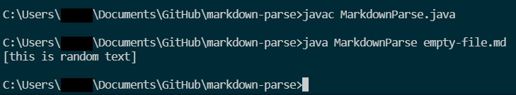
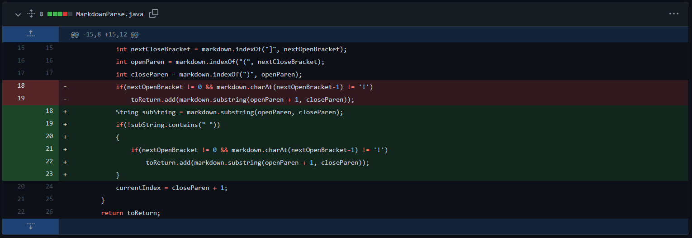
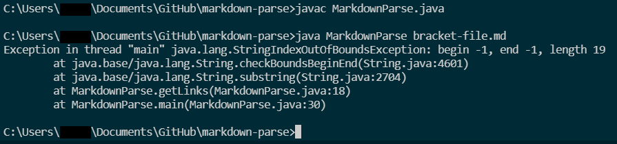
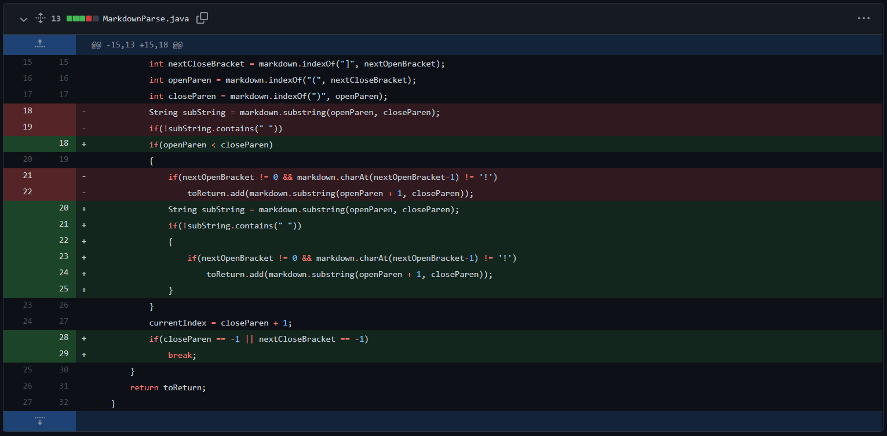

# CSE 15L Lab Report 2  Testing

## Problem #1: File with an Image Reference  
[new-file.md](https://github.com/JRUCSD/cse15l-lab-reports/blob/35d1bad71171e575c7a916517013974be5bd9509/new-file.md)  
### Symptom
  
### Code Change  
  
The result of this failure-inducing input, a markdown file containing only an image link, was the symptom of that image file being included in the output, when the expected output was an empty list, since the file contained no links `[]`. The bug was the program's inability to differentiate between links and images, fixed by skipping the algorithm to search for a link if an `!` was detected immediately before the first `[`. The bug was responsible for the symptom of an unexpected output, which itself was made apparent by the failure-inducing input not being properly handled by the program because of the bug.

## Problem #2: File with no Valid Links  
[empty-file.md](https://github.com/JRUCSD/cse15l-lab-reports/blob/35d1bad71171e575c7a916517013974be5bd9509/empty-file.md)  
### Symptom
  
### Code Change  
  
This bug in particular encompassed a variety of symptoms, so our group focused on fixing one: invalid links which contained a space being included as valid links. In this case, the failure inducing input contained no valid links, but a bug in the program that could not detect an invalid link caused the symptom where invalid links appeared in the list when they should have been excluded.

## Problem #3: File with [] but not ()  
[bracket-file.md](https://github.com/JRUCSD/cse15l-lab-reports/blob/35d1bad71171e575c7a916517013974be5bd9509/bracket-file.md)
### Symptom  
  
### Code Change  
  
In this instance, the bug arose from the previous fix to the program. With a failure-inducing input file that does not contain a set of parentheses, the value of the variables `openParen` and `closeParen` contain the unintended value of -1, which causes the symptom of a `StringIndexOutOfBoundsException` and the program to crash.