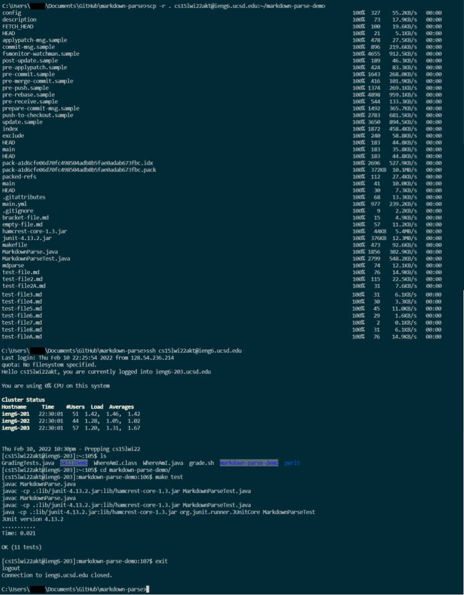

# CSE 15L Lab Report 3: Copy Directories with `scp -r`   
When it comes to directories, `scp` has some limitations. `scp <directory>` will only work if `<directory>` is empty. The workaround for this is recursion, thankfully we don't have to write any recursive algorithms or code, we just have to use it. `scp -r` assists in copying a directory by probing it and all of its subdirectories to copy them.  
   
Breaking down a common, practical example:  
`scp -r . <username>@ieng6.ucsd.edu~/<directory>`  
   
- `scp -r` has already been explained.  
- After that comes the path of the source directory. In this case, the current working directory is copied because of the `.` operator.  
- `<username>@ieng6.ucsd.edu~/` is the remote destination of the contents being copied.  
- `<directory>` is the name of the new directory that is created and where the contents will be copied onto the remote ssh.  

After running `scp -r`, logging into ssh and running `ls` will prove that a new directory has been created. running `cd <directory>` will show that all the files of the local directory have been copied as well. Using `markdown-parse` as an example, I'm able to move into the new `markdown-parse-demo` directory and, using a `makefile`, run `make test` to compile the java files of `markdown-parse-demo` to run `MarkdownParseTest` to confirm that everything still works remotely as it did on the local machine.

  

### Optimizations
Similar to the first post, the process of copying directories and running remote commands can be done on a single line. As a reminder, `;` allows for multiple commands to be run on a single line, & using `""` on commands following an ssh login command will remotely run the commands and immediately logout of the remote server.  