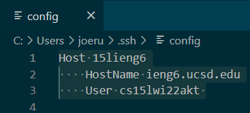
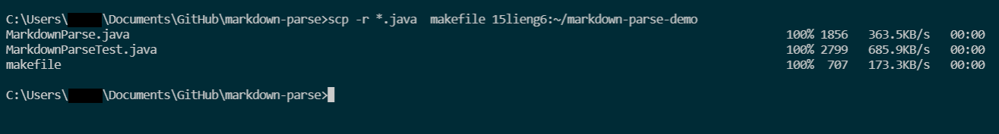

# CSE 15L Lab Report 3: Configuring ssh   
While ssh keys help to make logging into a remote server quicker, typing out a long username is still cumbersome and prone to typing errors. Thankfully, there's a way to shorten the ssh login username by giving it a nickname. To do this requires making changes in the `~/.ssh` directory, the same directory where one of the keys is located. Inside that directory edit the `config` file or create a new one and add these lines:  

    Host <nickname>
        HostName ieng6.ucsd.edu
        User <username> 
   
- `Host <nickname>` is the username that you choose to be your, hopefully shorter, login
- `HostName ieng6.ucsd.edu` is the remote server that is accessed when using the login nickname
- `User <username>` is your actual username associated with the remote server

Here's an example of what `config` should look like:
  

Now that the config file is set up, you can log in with your new nickname, it will be matched with the `HostName` and the actual username which was specified in the config file, sucessfully logging you in without having to type out your full username.
  

In fact, the nickname will work with just about anything involving `ssh`, for instance using `scp` with the nickname works the same as using the actul nickname to copy a file or directory
  

*Sidenote: If you're on windows an encounter an error, try adding this line:*  
`IdentityFile ~/.ssh/id_rsa`  
This will explicitly refer to the id_rsa file containing your key which should also be in the `~/.ssh` directory