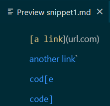
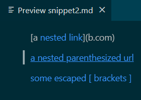
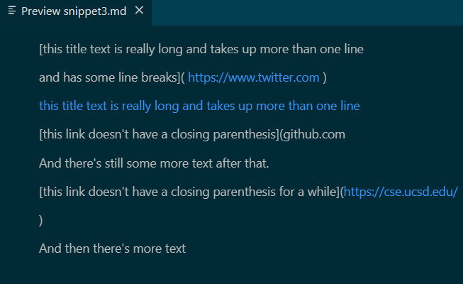
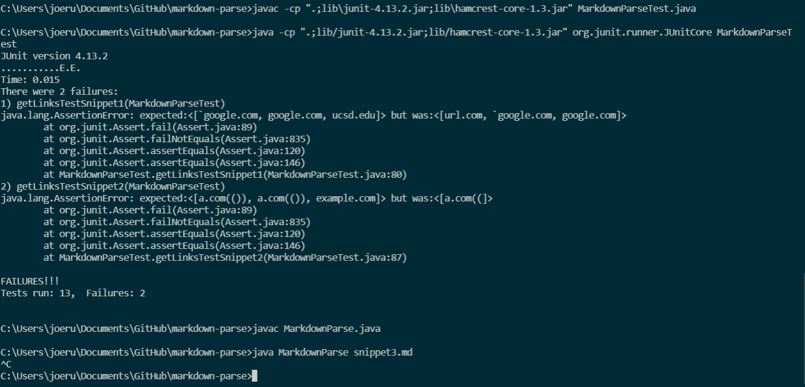
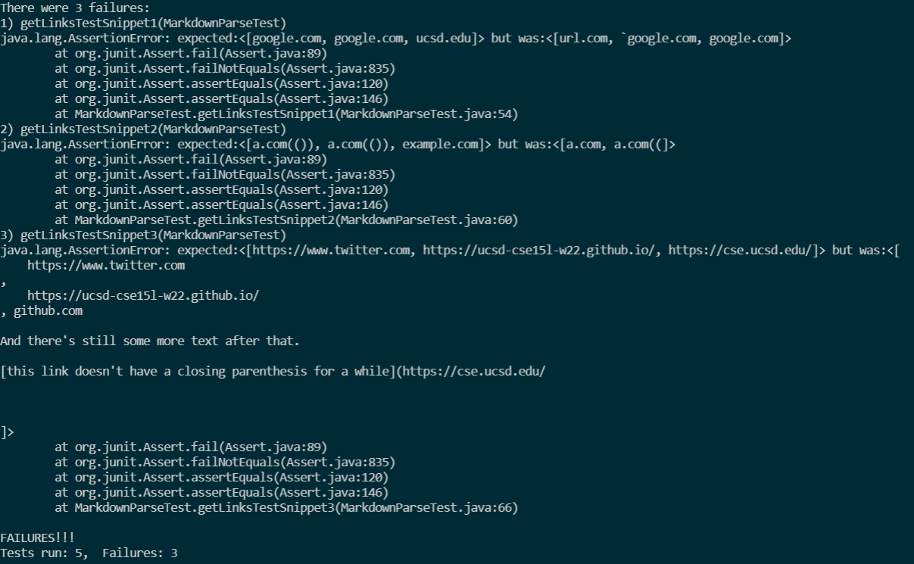

# CSE 15L Lab Report 4: More MarkdownParse Testing

### Expected Output of Markdown Snippets:
  
  
  

### Testing the Snippets
[snippet1](snippet1.md)  
[snippet2](snippet2.md)  
[snippet3](snippet3.md)  
```
@Test
public void getLinksTestSnippet1() throws IOException{
    Path fileName = Path.of("snippet1.md");
    String contents = Files.readString(fileName);
    assertEquals(List.of("`google.com", "google.com", "ucsd.edu"), MarkdownParse.getLinks(contents));
}
@Test
public void getLinksTestSnippet2() throws IOException{
    Path fileName = Path.of("snippet2.md");
    String contents = Files.readString(fileName);
    assertEquals(List.of("a.com(())", "a.com(())", "example.com"), MarkdownParse.getLinks(contents));
}
@Test
public void getLinksTestSnippet3() throws IOException{
    Path fileName = Path.of("snippet3.md");
    String contents = Files.readString(fileName);
    assertEquals(List.of("https://www.twitter.com", "https://ucsd-cse15l-w22.github.io/", "https://cse.ucsd.edu/"), MarkdownParse.getLinks(contents);
}
```

[My MarkdownParse](https://github.com/JRUCSD/markdown-parse)  
*All Tests Failed*  
  
*Snippet 3 failed for an additional reason because there's a bug in our groups code that has yet to be solved, causing an infinite loop*  

[Reviewed MarkdownParse](https://github.com/w2llS/markdown-parse)  
*All Tests Failed*  
  

### Fixing MarkdownParse

- **Snippet 1:** The issue presented with Snippet 1 can be solved with an if statement checking if there is a backtick that encloses the open bracket. If this check is done after the check for the close bracket and open parenthesis being next to each other, then this should be the only check needed to produce the expected output because if there was a backtick immediately after the close bracket, the link would be considered invalid before reaching the if statement involving the backtick.
- **Snippet 2:** For a test on Snippet 2 to produce the expected output, a larger change is likely required. One solution would involve implementing a stack to verify that nested pairs of brackets and parentheses match up correctly, which would require overhauling the rest of the code to work with the stack. A smaller, but still substantial amount of modification would be required if the stack was implemented alongside the existing variables and methods, rather than replacing them.
- **Snippet 3:** Most of the unexpected behavior of snippet 3 could be solved by considering trailing newlines within both the brackets and parentheses as trailing spaces, able to be ignored with String.trim(), since the text and links in between these trailing characters are still considered to be valid in markdown. For the link that does not have a closing paranthesis, it is considered invalid by a different test, checking if there's a space in between text of a link. However, the output is still unexpected, since the next link is still ignored. A sizable amount of code may be required to trace back through the String of text to verify if a skipped link was actually valid.

[<- Back](index.md)