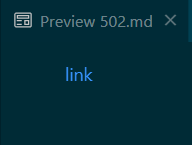
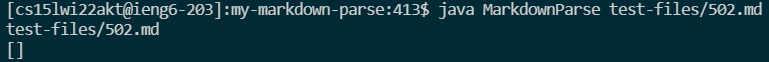
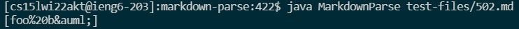
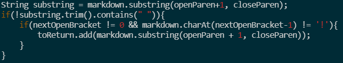
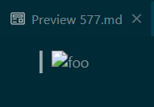
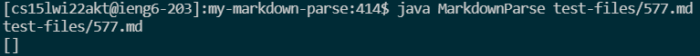
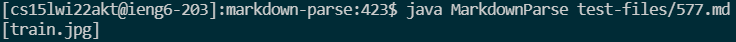
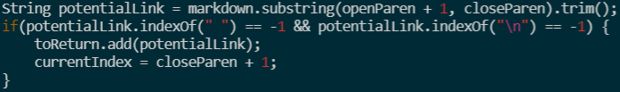

# CSE 15L Lab Report 5: Comparing Different Implementations

## Finding the Differing Results

In the directory which contained the directories for both markdown parse implementations, I used `diff`, specifically:  
`diff my-markdown-parse/results.txt markdown-parse/results.txt`  
 To find the files which caused the different output, I used vim to manually search through the `results.txt` produced using Joe's implementation because both files being analyzed resulted in a nonempty list with Joe's implementation compared to an empty list with my implementation, making it easier to find the output and its respective test file using his `results.txt`.  

## Test File [502.md](https://github.com/ucsd-cse15l-w22/markdown-parse/blob/main/test-files/502.md)

**Expected Output**  
  
**My Actual Output**
  
**Joe's Actual Output**
  

### Determining the Bug

  
The bug with my implementation is that when checking for an `!`, the first condition is that `nextOpenBracket != 0`. This was intended to prevent an `IndexOutOfBoundsException` when evaluating the next condition, `markdown.charAt(nextOpenBracket-1) != '!'`, but it causes links at the very start of a file to be excluded. Solving this bug would involve changing how an `!` is checked for, while still maintaining the check itself to continue excluding images from the list of links.  

## Test File [577.md](https://github.com/ucsd-cse15l-w22/markdown-parse/blob/main/test-files/577.md)

**Expected Output**  
  
**My Actual Output**
  
**Joe's Actual Output**
  

### Determining the Bug

  
The bug with Joe's implementation is that there is no check for an `!` before an open bracket `[`. While not the complete solution, a starting fix would be to include the check for the `!`, something like this pseudo code:  
`if(markdown.charAt(nextOpenBracket-1) != '!'){toReturn.add(link);}`

[<- Back](index.md)
